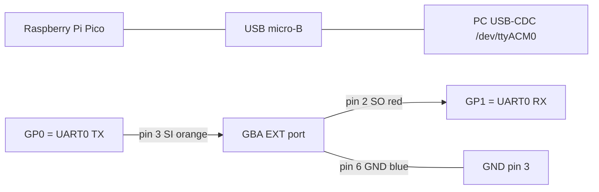

# Pi Pico bridge — GBA Link Cable to USB

Step-by-step guide for connecting Coldpakku to a PC through a Raspberry Pi
Pico (RP2040). Replaces the old bridge based on a Raspberry Pi 3/4 +
`/dev/ttyS0`. The Pico is cheaper (~4 EUR), needs no full OS, and its
GPIOs are native 3.3 V CMOS — the same electrical level as the GBA's SIO
in UART mode. **No level shifter is needed**.

## Bill of materials

- 1x Raspberry Pi Pico (any variant: Pico, Pico W, Pico 2 — all of them
  expose UART0 on GP0/GP1).
- 1x USB micro-B cable (or USB-C if you have a Pico 2).
- 1x sacrificial Game Link AGB-005 cable (cheap Chinese ones on eBay
  work). The GBA's EXT connector is proprietary; the easiest path is to
  cut one end off the cable and solder to the bare wires.
- A multimeter with continuity mode to identify pin↔wire mappings.
- Soldering iron + 3 jumper wires, or 3 female Dupont leads.

## GBA EXT connector pinout

Looking at the GBA's socket with the console facing up (the side where
you insert the cable):

```
| 1  3  5|     pin 1 = VDD (3.3V output, current-limited)
| 2  4  6|     pin 2 = SO  (Serial Out, GBA TX)
                pin 3 = SI  (Serial In,  GBA RX)
                pin 4 = SD  (Serial Data, MULTI mode)
                pin 5 = SC  (Serial Clock, MULTI/NORMAL)
                pin 6 = GND --
```

Source: GBATEK §AUX Link Port (Martin Korth) — the canonical reference.

In UART mode (which is what this firmware uses), only pins **2 (SO)**,
**3 (SI)** and **6 (GND)** matter. The rest are left unconnected.

> Heads up: the colours above are the original Nintendo ones. Clone
> cables often randomise the colour mapping. **Always verify with a
> multimeter** from the EXT connector to the cut end: red probe on the
> connector pin, the other probe touching each wire of the cable until
> you find continuity.

## Raspberry Pi Pico pinout

Top view (USB facing up), 40-pin header:

| Pico pin | GPIO | Function                  |
|---------:|:----:|---------------------------|
|   1      | GP0  | UART0 TX (to GBA SI)      |
|   2      | GP1  | UART0 RX (from GBA SO)    |
|   3      | GND  | ground (to GBA GND)       |
|  38      | GND  | ground (alternative)      |
|  40      | VBUS | 5V from USB (DO NOT wire) |
|  36      | 3V3  | 3.3V LDO   (DO NOT wire)  |

RP2040 datasheet §2.19: GPIOs are 3.3 V tolerant, **not 5 V tolerant**.
The GBA's SIO drives 3.3 V, so we're aligned.

## Wiring diagram

```
                +---- USB micro-B ---- PC (/dev/ttyACM0)
                |
       +--------+----------+
       |   Raspberry Pi    |
       |       Pico        |
       |                   |
       |  GP0 (pin 1)  TX -+----- orange --- pin 3 (SI) GBA EXT
       |  GP1 (pin 2)  RX -+----- red    --- pin 2 (SO) GBA EXT
       |  GND (pin 3)     -+----- blue   --- pin 6 (GND) GBA EXT
       +-------------------+

       NC: GBA pin 1 (VDD), pin 4 (SD), pin 5 (SC)
       NC: Pico VBUS (pin 40), 3V3 (pin 36) — the Pico is powered only over USB
```

Mermaid equivalent:



## Firmware

Simplest route — **MicroPython**:

1. Hold **BOOTSEL** and plug the USB cable. The Pico shows up as a drive
   named `RPI-RP2`.
2. Download the official UF2 from
   <https://micropython.org/download/RPI_PICO/>. Drag it onto the
   `RPI-RP2` drive. The Pico reboots and stops exposing itself as a
   drive.
3. Copy this repo's `pico/main.py` to the Pico's filesystem:

   ```bash
   pip install --user mpremote
   mpremote cp pico/main.py :main.py
   mpremote reset
   ```
   or, if you prefer a GUI: use Thonny (View → Files → save as `main.py`
   under "Raspberry Pi Pico").
4. Check that it shows up as a serial device:
   ```bash
   ls /dev/ttyACM*    # should list /dev/ttyACM0
   ```
5. Quick loopback without the GBA: connect a short jumper between GP0
   and GP1 and run:
   ```bash
   python3 -c "import serial; s=serial.Serial('/dev/ttyACM0',115200,timeout=1); s.write(b'hello'); print(s.read(5))"
   # expected: b'hello'
   ```
   If this works, the bridge is alive. Remove the loopback jumper.

Alternative **native C firmware (faster)**:
Flash the prebuilt UF2 from
[Noltari/pico-uart-bridge](https://github.com/Noltari/pico-uart-bridge):
same wiring, more consistent latency at 115200, no MicroPython needed.
Useful if sustained throughput causes trouble (this project sends at
most 4 KB per tx, so you shouldn't notice).

## End-to-end test

Once everything is connected and the `coldpakku.gba` ROM is running on
the GBA:

```bash
# Run the host with the new "serial" transport:
PYTHONPATH=.venv-tools:pc python3 pc/metamask_inject.py \
    --rpc https://rpc.sepolia.org \
    --transport serial --serial-port /dev/ttyACM0 \
    --to 0x000000000000000000000000000000000000dEaD \
    --value-wei 1000000000000000 \
    --address-from 0xYOUR_DERIVED_ADDRESS \
    --no-broadcast
```

The GBA shows the CONFIRM TX screen with all the parsed fields. Press
**A** to sign, **B** to cancel. The PC output prints the recovered
signature.

## Troubleshooting

| Symptom | Likely cause |
|---|---|
| `/dev/ttyACM0` does not appear | The Pico is still in BOOTSEL mode, or `main.py` was not copied. Reboot it with `mpremote reset`. |
| Garbled bytes / framing errors | TX and RX swapped. Remember: GBA SO goes to Pico RX, GBA SI comes from Pico TX. |
| GBA never answers READY | GND not connected, or the Link cable uses non-standard wire colours. Verify continuity pin-by-pin with a multimeter. |
| Works for a second or two then hangs | The MicroPython loop can stall. Switch to `Noltari/pico-uart-bridge` for stable latency. |
| Not enough bandwidth for tx > 1 KB | Bump `BUF_SIZE` in `pico/main.py` to 256, or flash the C firmware. |

## Why a Pico and not a full-size Raspberry Pi

| Thing | Pi 3/4/5 | Pi Pico |
|---|---|---|
| Cost | ~50 EUR | ~4 EUR |
| Setup | flash SD + Linux + systemd service | drag&drop UF2 + main.py |
| GPIO levels | 3.3V (compatible) | 3.3V (compatible) |
| UART latency | ~5 ms (kernel) | ~µs (bare-metal) |
| Power draw | ~3 W idle | ~0.1 W |
| Size | 8.6 x 5.6 cm | 5.1 x 2.1 cm |
| Needs SSH/network | yes | no |

The only reason to prefer a big Pi is if you want to run `web3.py` on
the bridge itself. In this project the host does all the heavy work and
the bridge just forwards bytes — for that, the Pico is simpler.
