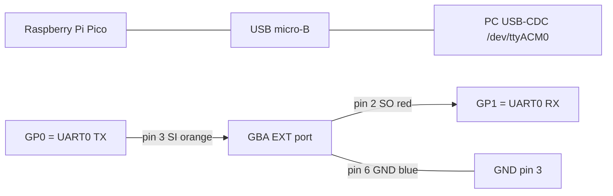

# Pi Pico bridge — GBA Link Cable a USB

Guía paso a paso para conectar el GBA Signer a un PC vía un Raspberry Pi
Pico (RP2040). Reemplaza al bridge antiguo basado en Raspberry Pi 3/4 +
`/dev/ttyS0`. El Pico es más barato (4 EUR), no requiere SO completo y sus
GPIO son 3.3V CMOS nativos — el mismo nivel eléctrico que el SIO del GBA en
modo UART. **No hace falta level shifter**.

## Materia prima

- 1x Raspberry Pi Pico (cualquier variante: Pico, Pico W, Pico 2 — todas
  tienen UART0 en GP0/GP1).
- 1x cable USB micro-B (o USB-C si tienes Pico 2).
- 1x cable Game Link AGB-005 sacrificable (los chinos en eBay valen). El
  conector EXT del GBA es propietario, lo más fácil es cortar uno de los
  extremos del cable y soldar a los pelados.
- Multímetro con función de continuidad para identificar pin↔cable.
- Soldador + 3 hilos jumper / o 3 cables Dupont hembra.

## Pinout del conector EXT del GBA

Mirando al socket del GBA con la consola hacia arriba (lado donde se
inserta el cable):

```
| 2  4  6 |     pin 1 = VDD (3.3V de salida, current-limited)
| 1  3  5 |     pin 2 = SO  (Serial Out, GBA TX) -- rojo en el Nintendo oficial
                pin 3 = SI  (Serial In,  GBA RX) -- naranja
                pin 4 = SD  (Serial Data, MULTI mode) -- marron
                pin 5 = SC  (Serial Clock, MULTI/NORMAL) -- verde
                pin 6 = GND -- azul
```

Fuente: GBATEK §AUX Link Port (Martin Korth) — referencia canónica.

En modo UART (que es el que usa este firmware) sólo importan los pines
**2 (SO)**, **3 (SI)** y **6 (GND)**. El resto se dejan al aire.

> Aviso: los colores de arriba son los de Nintendo originales. Cables
> clones suelen invertir colores aleatoriamente. **Verifica siempre con
> multímetro** desde el conector EXT al extremo cortado: pinza rojo en el
> pin del conector, otra pinza tocando cada hilo del cable hasta encontrar
> continuidad.

## Pinout del Raspberry Pi Pico

Vista superior (con la USB hacia arriba), header de 40 pines:

| Pico pin | GPIO | Función                  |
|---------:|:----:|--------------------------|
|   1      | GP0  | UART0 TX (al GBA SI)     |
|   2      | GP1  | UART0 RX (del GBA SO)    |
|   3      | GND  | tierra (al GBA GND)      |
|  38      | GND  | tierra (alternativa)     |
|  40      | VBUS | 5V del USB (NO conectar) |
|  36      | 3V3  | 3.3V LDO (NO conectar)   |

Datasheet RP2040 §2.19: GPIO son tolerantes a 3.3V, **no son 5V-tolerant**.
El SIO del GBA emite 3.3V, así que vamos perfectos.

## Esquema de conexión

```
                +---- USB micro-B ---- PC (/dev/ttyACM0)
                |
       +--------+----------+
       |   Raspberry Pi    |
       |       Pico        |
       |                   |
       |  GP0 (pin 1)  TX -+----- naranja --- pin 3 (SI) GBA EXT
       |  GP1 (pin 2)  RX -+----- rojo    --- pin 2 (SO) GBA EXT
       |  GND (pin 3)     -+----- azul    --- pin 6 (GND) GBA EXT
       +-------------------+

       NC: GBA pin 1 (VDD), pin 4 (SD), pin 5 (SC)
       NC: Pico VBUS (pin 40), 3V3 (pin 36) — el Pico se alimenta solo por USB
```

Mermaid equivalente:



## Firmware

Ruta más simple — **MicroPython**:

1. Mantén pulsado **BOOTSEL** y conecta el USB. Aparece como un drive
   `RPI-RP2`.
2. Descarga la UF2 oficial desde
   <https://micropython.org/download/RPI_PICO/>. Arrástrala al drive
   `RPI-RP2`. El Pico se reinicia y deja de exponerse como drive.
3. Copia el `pico/main.py` de este repo al sistema de ficheros del Pico:

   ```bash
   pip install --user mpremote
   mpremote cp pico/main.py :main.py
   mpremote reset
   ```
   o si prefieres GUI: usa Thonny (View → Files → guarda como `main.py` en
   "Raspberry Pi Pico").
4. Comprueba que aparece como serial:
   ```bash
   ls /dev/ttyACM*    # debe aparecer /dev/ttyACM0
   ```
5. Loopback rápido sin GBA: pon un cable corto entre GP0 y GP1 y prueba:
   ```bash
   python3 -c "import serial; s=serial.Serial('/dev/ttyACM0',115200,timeout=1); s.write(b'hello'); print(s.read(5))"
   # esperado: b'hello'
   ```
   Si esto funciona, el bridge está vivo. Quita el cable de loopback.

Alternativa **firmware C nativo (más rapido)**:
Flashea el UF2 precompilado de
[Noltari/pico-uart-bridge](https://github.com/Noltari/pico-uart-bridge):
mismo cableado, latencias más consistentes a 115200, no requiere
MicroPython. Útil si el throughput sostenido te da problemas (en este
proyecto enviamos como mucho 4 KB por tx, no debería notarse).

## Pruebas integradas

Una vez todo conectado y la ROM `gba-signer.gba` corriendo en el GBA:

```bash
# Lanza el host con la nueva variante "serial":
PYTHONPATH=.venv-tools:pc python3 pc/metamask_inject.py \
    --rpc https://rpc.sepolia.org \
    --transport serial --serial-port /dev/ttyACM0 \
    --to 0x000000000000000000000000000000000000dEaD \
    --value-wei 1000000000000000 \
    --address-from 0xTU_ADDRESS_DERIVADA \
    --no-broadcast
```

El GBA mostrará la pantalla CONFIRM TX con todos los campos parseados. Si
pulsas **A** firma; si pulsas **B** cancela. La salida del PC imprimirá la
firma recuperada.

## Troubleshooting

| Síntoma | Causa probable |
|---|---|
| `/dev/ttyACM0` no aparece | El Pico está en modo BOOTSEL todavía, o no se ha copiado `main.py`. Reinicia con `mpremote reset`. |
| Bytes corruptos / framing errors | TX y RX cruzados. Recuerda: GBA SO va a Pico RX, GBA SI viene del Pico TX. |
| GBA no responde a READY | GND no conectado, o el cable Link tiene los hilos en otros colores que los oficiales. Verifica continuidad con multímetro pin a pin. |
| Funciona uno o dos segundos y se cuelga | El loop MicroPython puede saturarse. Cambia a `Noltari/pico-uart-bridge` para latencia constante. |
| Velocidad insuficiente para tx > 1 KB | Sube `BUF_SIZE` en `pico/main.py` a 256, o flashea el firmware C. |

## Por qué Pico y no Raspberry Pi grande

| Cosa | Pi 3/4/5 | Pi Pico |
|---|---|---|
| Coste | ~50 EUR | ~4 EUR |
| Setup | flashear SD + Linux + servicio systemd | drag&drop UF2 + main.py |
| Niveles GPIO | 3.3V (compatible) | 3.3V (compatible) |
| Latencia UART | ~5 ms (kernel) | ~µs (bare-metal) |
| Consumo | ~3 W idle | ~0.1 W |
| Tamaño | 8.6 x 5.6 cm | 5.1 x 2.1 cm |
| Necesita SSH/red | sí | no |

El único motivo para preferir un Pi grande es si quieres correr `web3.py`
en el propio bridge. En este proyecto el host hace el grueso del trabajo,
el bridge solo pasa bytes — y para eso el Pico es más simple.
